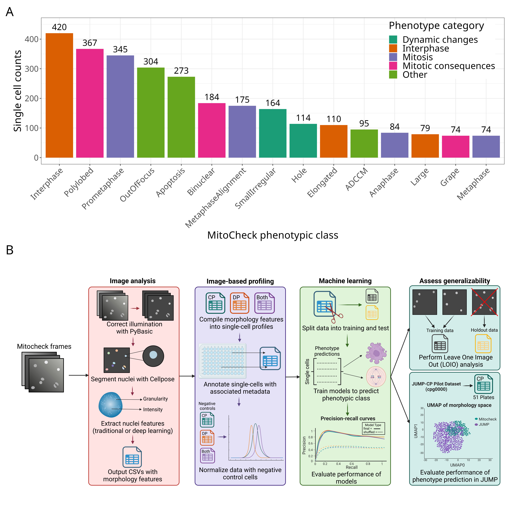

# Phenotypic Profiling Model

We use publicly-available data from the MitoCheck consortium, which includes 2,916 single-cells labeled with one of 15 different phenotypes, to train a multiclass logistic regression model to predict phenotype.

Figure 1 describes the dataset and our approach for training and evaluating our model.



> Figure 1. Dataset and analysis approach. (A) Single-cell counts per labeled phenotype stratified by phenotype category. The labeled MitoCheck dataset included a total of 2,916 single nuclei. The original dataset contained labels for 16 classes, but we have removed “folded” because of low counts. Counts are not evenly distributed between the classes. (B) Our analysis pipeline incorporated image analysis, image-based profiling, and machine learning.

## Environment Setup

Perform the following steps to set up the `phenotypic_profiling` environment necessary for processing data in this repository.

### Step 1: Create Phenotypic Profiling Environment

```sh
# Run this command to create the conda environment for phenotypic profiling

conda env create -f phenotypic_profiling_env.yml
```

### Step 2: Activate Phenotypic Profiling Environment

```sh
# Run this command to activate the conda environment for phenotypic profiling

conda activate phenotypic_profiling
```

## Repository Structure:

The repository structure is as follows:

| Order | Module | Description |
| :---- | :----- | :---------- |
| [0.download_data](0.download_data/) | Download training data | Download labeled single-cell dataset from [mitocheck_data](https://github.com/WayScience/mitocheck_data) |
| [1.split_data](1.split_data/) | Create data subsets | Create training and testing data subsets |
| [2.train_model](2.train_model/) | Train model | Train ML models on combinations of features, data subsets, balance types, model types |
| [3.evaluate_model](3.evaluate_model/) | Evaluate model | Evaluate ML models on all data subsets |
| [4.interpret_model](4.interpret_model/) | Interpret model | Interpret ML model coefficients |
| [5.validate_model](5.validate_model/) | Validate model | Validate ML models on other datasets |
| [6.single_cell_images](6.single_cell_images/) | Single cell images | View single cell images and model interpretation |
| [7.figures](7.figures/) | Figures | Create paper-worthy figures |

## Data

Specific data download/preprocessing instructions are available at: https://github.com/WayScience/mitocheck_data.
This repository downloads labeled single-cell data from a specific version of the [mitocheck_data](https://github.com/WayScience/mitocheck_data) repository.
For more information see [0.download_data/](0.download_data/).

We use the following 2 datasets from the `mitocheck_data` repository:
- `ic`: single-cell nuclei features extracted after performing illumination correction on images
- `no_ic`: single-cell nuclei features extracted without performing illumination correction on images

### Supplementary Table 1 - Full list of JUMP-CP phenotype enrichment

We report the top 100 most enriched treatments per phenotype in Supplementary Table 1 of our paper.
See [`jump_compare_cell_types_and_time_across_phenotypes.tsv.gz`](https://github.com/WayScience/phenotypic_profiling_model/blob/6cd37b2e9255892bed703c56d466806ea63d7066/3.evaluate_model/jump_phenotype_profiles/jump_compare_cell_types_and_time_across_phenotypes.tsv.gz) for the full list.

## Machine Learning Models

We use [Scikit-learn (sklearn)](https://scikit-learn.org/) for data manipulation, model training, and model evaluation.
[Pedregosa et al., JMLR 12, pp. 2825-2830, 2011](http://jmlr.csail.mit.edu/papers/v12/pedregosa11a.html) describe `scikit-learn` as a machine learning library for Python.
Its ease of implementation in a pipeline makes it ideal for our use case.

We consistently use the following parameters with many `sklearn` functions:

- `n_jobs=-1`: Use all CPU cores in parallel when completing a task.
- `random_state=0`: Use seed 0 when shuffling data or generating random numbers.
This allows "random" sklearn operations to have consist results.
We also use `np.random.seed(0)` to make "random" numpy operations have consistent results.

We use [seaborn](https://seaborn.pydata.org/) for data visualization. 
[Waskom, M.L., 2021](https://doi.org/10.21105/joss.03021) describe `seaborn` as a library for making statisical graphics in python.

All parts of the machine learning pipeline are completed with the following feature types:
- `CP`: Use only CellProfiler features from `MitoCheck` labeled cells
- `CP_zernike_only`: Use only CellProfiler Zernike shape features from `MitoCheck` labeled cells
- `CP_areashape_only`: Use only CellProfiler areashape features from `MitoCheck` labeled cells
- `DP`: Use only DeepProfiler features from `MitoCheck` labeled cells
- `CP_and_DP`: Use CellProfiler and DeepProfiler features from `MitoCheck` labeled cells

See [MitoCheck_data](https://github.com/WayScience/mitocheck_data) for more information on feature types and how they are extracted from `MitoCheck` labeled cells.

We create two versions of the same machine learning model:
- `final`: Model fit using real feature values
- `shuffled_baseline`: Model fit using shuffled training data (to create a suitable baseline comparison for the final model during evaluation)

## Intermediate Data

Throughout this repository, we store intermediate `.tsv` data in tidy long format, a standardized data structure (see [Tidy Data](https://vita.had.co.nz/papers/tidy-data.pdf) by Hadley Wickham for more details).
This data structure makes later analysis easier.

Some intermediate data used in this repository are too large to be stored on GitHub.
These intermediate data are available on the [Way Lab Zenodo page](https://zenodo.org/communities/wayscience/).

## Reproducibility

Specific code and steps used are available within each module folder.

The [Way Lab](https://www.waysciencelab.com/) always strives for readable, reproducible computational biology analyses and workflows.
If you struggle to understand or reproduce anything in this repository please [file an issue](https://github.com/WayScience/mitocheck_data/issues/new/choose)!
